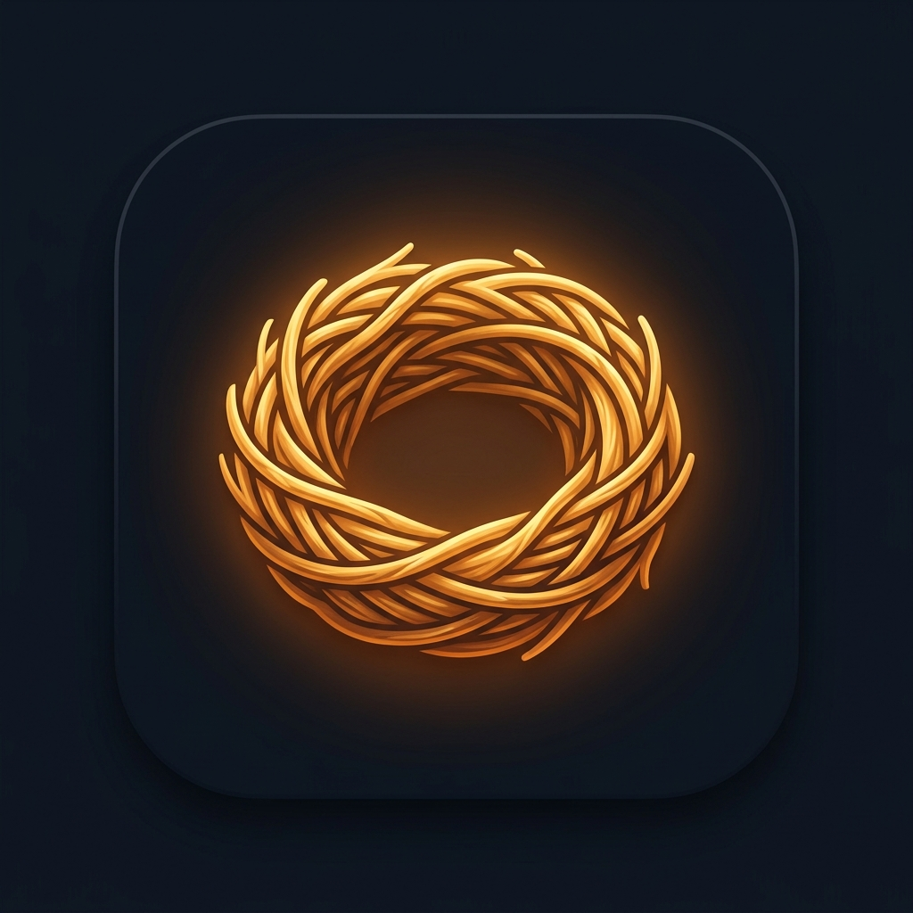

# 🪺 TabNest

**Your personal link hub — replace tab-hoarding with organised, fast, always-available link groups.**

> *"Every nest starts with one twig. Add your first link and give it a home."*



---

## 🧠 The Problem

Keeping dozens of browser tabs open as a memory system works — until your phone lags, heats up, and crashes. TabNest replaces the *habit* of tab-hoarding with a lightweight personal webpage that holds "the websites I use, grouped the way I think about them."

Close your tabs freely. Your links are safe.

---

## ✨ Features

### Core
- 📁 **Groups (Nests)** — Create, rename, recolor, and emoji-tag groups that mirror your mental model
- 🔗 **Links** — Add URLs with auto-fetched favicons, custom titles, and optional notes
- 🔍 **Live Search** — Filters across all groups instantly as you type; matching cards glow, others dim
- 🕐 **Recently Opened** — Last 10 visited links surface at the top — no hunting required
- 💾 **Export / Import** — Full JSON backup and restore (your safety net against clearing browser data)
- 📱 **PWA / Add to Home Screen** — Works as a standalone app icon on Brave Android

### UI (Brave Tab Groups, reimagined)
| Feature | Description |
|---------|-------------|
| 2-column card grid | One card per group, ordered your way |
| 2×2 favicon preview | See up to 4 links at a glance per card |
| `+N` overflow badge | Know exactly how many more links are hidden |
| One-tap tile shortcut | Tap a favicon tile → link opens instantly, skip the group view |
| Slide-in group view | Full link list with swipe-back gesture |
| FAB bloom menu | Long-press `+` for "Add Link" / "New Nest" options |

### Delight Layer
- 🌅 **Time-aware background** — Gradient shifts with the hour (dawn / day / dusk / night)
- ✨ **Confetti** on every new group created
- ✈️ **Paper plane** animation on export and import
- 💫 **Ripple**, shimmer skeleton, spring drag, haptic feedback
- ♿ `prefers-reduced-motion` fully respected

### Easter Eggs 🥚
| Trigger | Reward |
|---------|--------|
| Konami code `↑↑↓↓←→←→BA` | 🔓 Developer Mode — visit counts & timestamps per link |
| Triple-tap logo (within 800ms) | Cycles 5 secret themes: Default → Retro CRT → Matrix → Mono → Cyberpunk |
| Type `tabnest` in search | Hidden About card |
| Long-press logo (2s) | Credits modal |

---

## 🗂️ Project Structure

```
Tab-nest/
├── index.html      # The entire app — HTML + CSS + JS, zero dependencies
├── manifest.json   # PWA manifest (Add to Home Screen)
├── sw.js           # Service Worker — offline support + favicon caching
├── icon-192.png    # Home screen icon (small)
└── icon-512.png    # Home screen icon (large)
```

---

## 🚀 Quick Start

### Option 1 — Local (instant)
Just open `index.html` in any browser. Data saves to `localStorage` automatically.

### Option 2 — GitHub Pages (recommended for PWA)
```
https://surisettymarthandasai.github.io/Tab-nest/
```
Enable via: **Repo Settings → Pages → Branch: main → / (root) → Save**

### Option 3 — Any static host
Netlify, Vercel, Cloudflare Pages — drag and drop the folder. Done.

---

## 📲 Install on Brave Android

1. Open the GitHub Pages URL in Brave
2. Tap `⋮` → **Add to Home Screen**
3. TabNest is now a standalone app icon — no browser chrome, no URL bar

---

## 💾 Data Model

All data lives in `localStorage` under the key `tabnest_v1`.

```json
{
  "groups": [
    { "id": "...", "name": "Dev Tools", "color": "#14B8A6", "emoji": "🔬", "order": 1 }
  ],
  "links": [
    {
      "id": "...", "groupId": "...", "url": "https://...",
      "title": "MDN Web Docs", "note": "always need this",
      "faviconUrl": "...", "createdAt": 1234567890,
      "lastOpenedAt": 1234567999, "order": 1
    }
  ]
}
```

**Backup anytime:** `⋮ menu → Pack your nest for the journey` → downloads `tabnest-backup.json`

---

## ⌨️ Keyboard Shortcuts

| Key | Action |
|-----|--------|
| `/` | Focus search bar |
| `Esc` | Close modal / panel |
| `Enter` | Save (in URL or group name field) |

---

## 🛠️ Tech Stack

| Layer | Choice | Why |
|-------|--------|-----|
| Structure | HTML5 | Single file, zero build step |
| Styling | Vanilla CSS + custom properties | Full control, 60fps animations |
| Logic | Vanilla JS (ES2020) | No framework overhead |
| Persistence | `localStorage` | No backend needed |
| Icons | Google Favicon API | Auto-fetches any site's icon |
| PWA | Web App Manifest + Service Worker | True offline + home screen install |
| Fonts | Inter (Google Fonts) | Razor-sharp on Android |

**Total size: ~60 KB** (HTML) + icons. First paint is near-instant even on a 5-year-old Android.

---

## 🔮 Future Ideas (Parking Lot)

- [ ] Share-sheet "quick add" from Brave → TabNest
- [ ] Bulk import from Brave's exported bookmarks HTML
- [ ] Cross-device sync (Spring Boot + MySQL backend)
- [ ] Usage-based auto-sorting (most-opened links float up)
- [ ] Dark/light theme toggle

---

## 👤 Author

**Marthanda Sai** — built this because 47 open browser tabs is too many.

---

## 📄 License

MIT — do whatever you want with it.